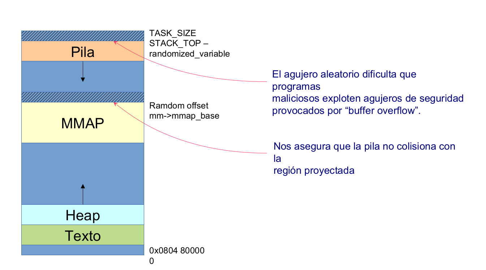
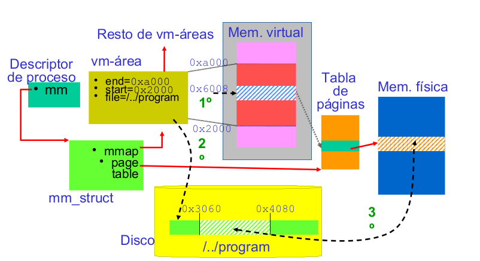

# TEMA 3: GESTIÓN DE MEMORIA
## REPASO
### Elementos hardware

**▷** **MEMORIAS CACHÉ:**
memorias intermedias que mantienen instrucciones/datos
previamente accedidos y que son más rápidas que la RAM.

**▷** Para cachés, definimos:

 · **Acierto de cache:** la instrucción/dato buscado está en ella. 
 
 · **Fallo de caché:** la instrucción/dato no esta en la misma.
 
 - **Funcionamiento de una caché:** Las memorias cachés funcionan gracias a la localidad de las referencias del código, datos, etc, es decir, normalmente, si un item es referenciado, las direcciones próximas a el tienden a ser referenciadas, por lo tanto, **localidad espacial**, y si un item es referenciado, suele volver a usarse, por lo tanto, **localidad temporal**.

**▷TIEMPO DE ACCESO EFECTIVO(TAE)**: Coste de acceder a memoria.
**TAE = p·ta + (1-p)·tf**   donde: **p**=probabilidad de acierto; **ta**=tiempo de acceso si
hay acierto;  **1-p**= probabilidad de fallo, y **tf**=tiempo de
acceso si hay fallo.


**▷ESPACIOS LÓGICOS Y FÍSICOS**

· La necesidad de poder reubicar un programa en
memoria hace necesario separar el espacio de
direcciones generadas por el compilador, espacio
lógico o virtual, del espacio físico en el que se
carga, el espacio de direcciones físicas (en RAM).

· **Dirección lógica** - la generada por la CPU;
también conocida como virtual.

· **Dirección física** - dirección que se pasa al
controlador de memoria.

**▷ TRADUCCIÓN DE DIRECCIONES**

La separación de espacios me obliga a realizar una
traducción de direcciones:

FALTA IMAGEN

+ **UNIDAD DE GESTIÓN DE MEMORIA MMU (Memory Management Unit):**
 Dispositivo hardware que se encarga de: 
 1. Traducir direcciones virtuales en direcciones físicas.
 2. Implementar la protección.
 
La forma de la MMU dependerá del esquema de gestión
de memoria implementado en hardware. En el esquema
más simple, contendrá un registro de reubicación que
almacena el valor a sumar a cada dirección generada por
el proceso de usuario al mismo tiempo que es enviado a
memoria.

  - **Funcionamiento:**
           Cuando el procesador genera una dirección virtual, es realmente el compilador el que genera el espacio
           del proceso, por lo tanto, es el que asigna direcciones. Lo que lee la CPU del código binario son
           direcciones de memoria virtuales y es la MMU la que traduce esas direcciones virtuales en físicas y si no
           puede acceder a ella, genera una excepción.
           
    **Problema:**  Fragmentación: fracción de memoria que no es asignable debido al propio mecanismo de gestión de memoria.
     
   Los SOs actuales suelen utilizar paginación como esquema básico de gestión de memoria, si bien, dependiendo del procesador,              deben también utilizar segmentación. Por ejemplo, los procesadores Intel implementan segmentación como esquema básico de                gestión de memoria (protección:modos de funcionamiento del procesador) y opcionalmente se puede activar o no la paginación.
   
   - **Paginación**
   La MMU “divide” el programa en bloques del mismo tamaño, denominados páginas, para cargarlos en bloques de memoria principal del mismo tamaño, denominados marcos. El SO mantiene la pista de cuales son los marcos que contienen las páginas de un programa mediante una estructura de datos por proceso denominada tabla de páginas (TP). Esta estructura tiene una entrada de TP (PTE) por cada página del proceso, donde cada entrada indica cual es la dirección base de memoria principal del marco que la contiene. También contiene información de protección de la página.
   
Dos tipos:

Paginación simple: Se introduce una caché hardware en la MMU para acelerar la traducción (TLB,
especie de chuleta, relación d.virtual con d.física, hago una consulta en todas las filas, y si está pues
me evita buscar).
Paginación multinivel: Desarrollada en el tema.

  - **Segmentación**
  Troceamos el programa en unidades lógicas de programación (procedimientos, pilas, código, datos, tabla de símbolos, etc.)
denominadas segmentos.Cada segmento suele tener una tamaño diferente del resto. Ahora, una dirección lógica es una tupla:
<número_de_segmento, desplazamiento>. Cada programa tiene una Tabla de Segmentos dondecada entrada tiene los
siguientes elementos:
 base - dirección física donde reside el inicio del segmento en memoria.
 límite - longitud del segmento.
   
   
## 3. Gestión de Memoria en Linux
### Niveles de Gestión de Memoria.

Existen dos niveles con requisitos diferentes:

* **Gestor de memoria de SO:**
	
	· Asigna porciones de memoria a los procesos (es
	no crítica).
	
	· Asigna memoria a los subsistemas del SO (crítica).

* **Gestor de memoria de procesos:** gestiń dinámica 
de los procesos (malloc, free, ...)

### Gestor de memoria en Linux

Tiene dos interfaces:

· Interfaz de llamadas al sistema: interfaz de usuario.
	
· Interfaz intra-kernel: interfaz de mm al resto del kernel.

### Elementos de Gestión.

La implementación Linux de gestión de memoria cubre:

* Memoria kernel:
	1. Distribuidor sistema amigo para asignar grandes bloques contiguos 
	de memoria.

	2. Distribuidores tableta, para asignar memoria 
	inferior a una página.
			
	3.Mecanismo `vmalloc()` para asignar bloques no contiguos de memoria.
	
* Memoria de usuario:
			
	1. Mecanismos de construcción y gestión de los espacios de direcciones 
	de los procesos.

### Gestión de memoria para procesos.

La asignación de memoria dinámica a los procesos de usuario tiene requisitos 
diferentes que a los del kernel:

* Las peticiones de procesos no se consideran urgentes: el kernel intenta 
diferir su asignación, ya que la solicitud no indica utilización inmediata.
	
* Los procesos de usuario no son confiables: el kernel debe estar preparado 
para atrapar errores de direccionamiento.
	
* Cada proceso tiene su propio espacio de direcciones separado del resto de 
procesos.
	
* El kernel puede anadir/suprimir rangos de direcciones lineales.
	
### Regiones de memoria	
	
El kernel representa un intervalo de direcciones lineales contiguas con el mismo
tipo de protección mediante un recurso denominado región de memoria.

Estas se caracterizan por su dirección de inicio, su longitud y los derechos de 
acceso. Por eficiencia, estas tienen un tamaño múltiplo del tamaño de página.

EJEMPLO:

> * región de código: permisos lectura-ejecución.
> * región de datos : permisos de lectura-escritura.
> * región de pila  : lectura-escritura, crecimiento.

Las tablas de páginas NO son adecuadas para representar espacios de direcciones
grandes, especialmente si son dispersos, que entonces se superpone otra gestión 
de memoria sobre la paginación.

Linux representa cada región de memoria con una estructura denominada vm-área.
Las vm-área contienen información necesaria para poder establecer la traducción
de una dirección que la TP no pueda realizar.

El ED de un proceso se representa como una lista de vm-áreas. Si el número de
vm-áreas se organizan en un árbol rojo-negro.

Las vm-áreas no tienen contador de referencias, por lo que solo pueden pertenecer 
a un proceso
	
	   


## Linux y VM-areas

Linux representa cada región de memoria con una estructura denominada
`vm-area` (virtual memory area). Contienen la información para
realizar la traducción de una dirección que la TP no pueda
realizar. El espacio de direcciones de un proceso se representa como
una lista de vm-areas. Si es muy elevado se representa en un arbol
rojo-negro. **NO** tienen contador de referencias (solo pueden pertenecer a un proceso).

Cada vm-area viene definida por un struct. Sus componentes son:

* Un rango de dirección determinado por una dirección de inicio y otra de fin.
* Indicadores VM. Palabra que contiene entre otros los permisos para
  un proceso (`VM_READ`, `VM_WRITE`, `VM_EXEC`)
* Información de enlace: Punteros al subarbol derecho e izquierdo de la lista de vm-areas.
* Información de archivo proyectado: Si el vm-area proyecta un
  archivo, este componente almacena el puntero a archivo y el
  desplazamiento necesario para localizar los datos.
* Operaciones VM y datos privados. Contiene:
  
  - Datos privados.
  - Puntero a operaciones VM: apunta a funciones. Proporciona a las
    vm-areas característias de orientación a objetos. Cada vm-area
    puede tener distintos manejadores.
  - Cualquier objeto (sistema de archivos, dispositivos de caracteres,
    ...) proyectado en memoria de usuario (`mmap`) puede suministrar
    sus propias operaciones. Algunas son: `open() / close()` para
    crear y destruir un vm-area respectivamente y `fault()`manejador
    de falta de página que no está en la TP.
	



### Llamadas relacionadas con regiones

Las llamadas relacionadas con la creación, destrucción o modificación de regiones de memoria son:

* `brk()` - Cambia el tamaño del heap de un proceso.
* `exec()` - Carga un nuevo programa ejecutable.
* `exit()` - Termina el proceso actual.
* `fork()` - Crea un nuevo proceso.
* `mmap()` - Crea una proyección de memoria para un archivo.
* `munmap()` - Destruye una proyección de memoria para un archivo.
* `shmat()` - Crea una región de memoria compartida.
* `shmdt()` - Destruye una región de memoria compartida.

El descriptor de mm_struct es

```c
struct mm_struct {
	struct vm_area_struct *mmap; //Lista de áreas de memoria (VMAs)
	struct rb_root mm_rb //Árbol red-black de VMAs, para buscar un elemento concreto
	struct list_head mmlist; //Lista con todas las mm_struct: espacio de direcciones
	atomic_t mm_users //Número de procesos utilizando este espacio de direcciones
	atomic_t mm_count /*Contador que se activa con la primera referencia al espacio 
	de direcciones y se desactiva cuando mm_users vale 0*/
	
	//Límites de las secciones principales
	unsigned long start_code; //Primera dirección de código
	unsigned long end_code; //Última dirección de código
	unsigned long start_data; //Primera dirección de datos
	unsigned long end_data; //Última dirección de datos
	unsigned long start_brk; //Primera dirección de heap
	unsigned long brk; //Última dirección de heap
	unsigned long start_stack; //Primera dirección de la pila
	unsigned long arg_start; //Principio de los argumentos
	unsigned long arg_end; //Final de los argumentos
	unsigned long env_start; //Principio del ámbito del proceso
	unsigned long env_end; //Final del ámbito de proceso
	
	//Información relacionada con las páginas
	pgd_t *pgd //Directorio global de páginas
	unsigned long rss; //Páginas contenidas
	unsigned long total_vm; //Número de páginas totales
}


